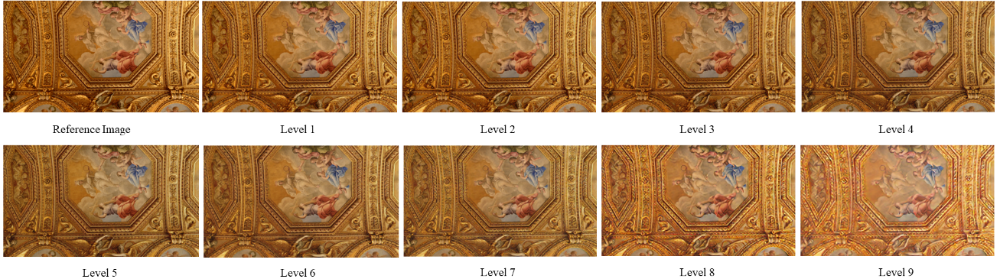

<div align="center">
  <h1>CNN-Oriented JND Dataset for Perception-Oriented Image Optimization</h1>

  <p>
    <strong>Xuelin Shen</strong><sup>1</sup>, 
    <strong>Haoqiao Ou</strong><sup>1,2</sup>, 
    <strong>Zhangkai Ni</strong><sup>3</sup>, 
    <strong>Wenhan Yang</strong><sup>4</sup>, 
    <strong>Shiqi Wang</strong><sup>5</sup>, 
    <strong>Sam Kwong</strong><sup>6</sup>
  </p>

  <p>
    <small>
    <sup>1</sup> Guangdong Laboratory of Artificial Intelligence and Digital Economy (SZ), Shenzhen, China<br>
    <sup>2</sup> College of Computer Science and Software Engineering, Shenzhen University, Shenzhen, China<br>
    <sup>3</sup> Key Laboratory of Embedded System and Service Computing (Ministry of Education),<br> School of Computer Science and Technology, Tongji University, Shanghai, China<br>
    <sup>4</sup> Peng Cheng Laboratory, Shenzhen, China<br>
    <sup>5</sup> Department of Computer Science, City University of Hong Kong, Kowloon, Hong Kong<br>
    <sup>6</sup> School of Data Science, Lingnan University, Tuen Mun, Hong Kong
    </small>
  </p>
</div>

## 📖 Instruction

>The CNN-Oriented JND Dataset is a large-scale benchmark constructed to study just-noticeable-distortion (JND) under CNN-generated distortions and to support perception-oriented optimization for low-level vision models. It contains 500 high-quality natural images curated from the RAISE dataset across five semantic categories (outdoor, indoor, building, human, nature), each cropped to 16:9 and resized to 1920×1080. For every source image, nine degraded versions with monotonically increasing distortion levels are generated using U-Net style autoencoders trained with different combinations of pixel-wise and perceptual losses, resulting in 4,500 CNN-distorted images whose degradations more strongly affect global color distribution and object shaping than traditional quantization artifacts. JND labels are obtained via controlled subjective experiments with twenty participants using a double-stimulus binary search protocol compliant with ITU BT.500, followed by outlier removal and kurtosis-based normality checks to ensure reliable JND thresholds. The corresponding JND images serve as ground truth for training a CNN-oriented JND inference model, which can then be used as a plug-in component for JND-based domain adaptation in tasks such as image super-resolution and learned image compression.

## 🖼️ Preview

<p align="center">
  
</p>

## 🔗 Download Link

### BaiduNetDisk

Model | Download | Password
:-: | :-: | :-:
Session1_original & 9 Distorted | [BaiduNetDisk](https://pan.baidu.com/s/1rGN4GnWrVM-EjtMWwrbYCw) |189j
Session2_original & 9 Distorted | [BaiduNetDisk](https://pan.baidu.com/s/1yMZWiIkJxYwD4O_1tfnSQg) | b4q8
Session3_original & 9 Distorted | [BaiduNetDisk](https://pan.baidu.com/s/1_Uz60SfjYwDu6jb1XhyArg) | 7dmt
Session4_original & 9 Distorted | [BaiduNetDisk](https://pan.baidu.com/s/1i7XJDmS9UYmvZNzcqLNEPA) | b87w
Original_JND_Pair | [BaiduNetDisk](https://pan.baidu.com/s/1eNBr-pvZL-US1U1dbc31vQ) | b5sp
JND_Judgements | [BaiduNetDisk](https://pan.baidu.com/s/1XFPyI2peGlNV-QYw245Eyg) | kjag

### Mega
Coming Soon

## Contact
If you have any questions, please feel free to contact me: xuelishen2-c@my.cityu.edu.hk

## 📝 Citation
If you are using this dataset in your research work, please kindly refer to the following paper:

>[1] X. Shen, H. Ou, Z. Ni, W. Yang, S. Wang and S. Kwong, "Transferring From Distortion to Perception-Oriented Optimization: Just-Noticeable-Distortion-Based Domain Adaptation," in IEEE Transactions on Multimedia, vol. 27, pp. 8199-8211, 2025.


```
@ARTICLE{11146676,
  author={Shen, Xuelin and Ou, Haoqiao and Ni, Zhangkai and Yang, Wenhan and Wang, Shiqi and Kwong, Sam},
  journal={IEEE Transactions on Multimedia}, 
  title={Transferring From Distortion to Perception-Oriented Optimization: Just-Noticeable-Distortion-Based Domain Adaptation}, 
  year={2025},
  volume={27},
  pages={8199-8211},
  doi={10.1109/TMM.2025.3604973}}
```